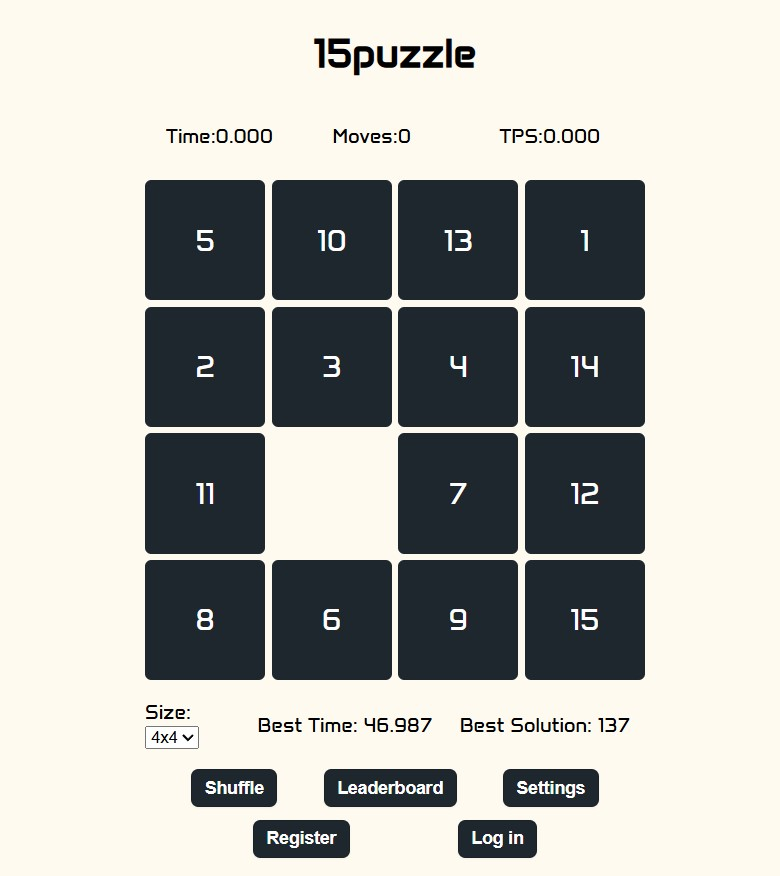

# 15puzzle

A full-stack web application version of the classic **15 Puzzle** game.

🎮 **Play now**: [tinyurl.com/15-puzzle](https://tinyurl.com/15-puzzle)

---

## 🧩 Features
- Different puzzle sizes (3×3, 4×4, 5×5, etc.)
- User registration & login system
- Time-based scoring & global leaderboard
- Fully responsive web interface
---

## 🚀 Tech Stack

- **Frontend**: HTML, CSS, JavaScript  
- **Backend**: Java, Spring Boot  
- **Database**: MySQL  

---

